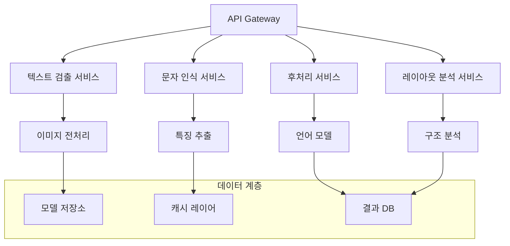

# OCR 배포 및 통합 - 종합 분석

## 연구 개요
날짜: 2025.08.02
주제: OCR 시스템의 API, 클라우드, 엣지 환경에서의 배포 및 통합 전략
시각: 컨테이너화, 마이크로서비스, 엣지 컴퓨팅, IaC, 서비스 메시, 쿠버네티스

## 1. OCR 배포 환경 개요

### 1.1 현대 OCR 배포 트렌드 (2025년)

OCR 시스템의 배포는 전통적인 단일 서버 배포에서 클라우드 네이티브, 엣지 컴퓨팅, 하이브리드 환경으로 발전하고 있다. 주요 배포 패턴은 다음과 같다:

#### **클라우드 네이티브 OCR**
- **마이크로서비스 아키텍처**: 텍스트 검출, 인식, 후처리를 독립 서비스로 분리
- **컨테이너 오케스트레이션**: Kubernetes 기반 자동 스케일링 및 관리
- **서버리스 OCR**: AWS Lambda, Google Cloud Functions 활용
- **API 게이트웨이**: 통합된 OCR API 엔드포인트 제공

#### **엣지 OCR 배포**
- **경량 컨테이너**: 리소스 제약 환경을 위한 최적화
- **온디바이스 추론**: 모바일, IoT 디바이스에서 직접 OCR 실행
- **하이브리드 처리**: 엣지에서 전처리, 클라우드에서 복잡한 분석
- **오프라인 기능**: 네트워크 연결 없이도 OCR 기능 제공

#### **멀티클라우드 및 하이브리드**
- **플랫폼 독립성**: 여러 클라우드 제공업체 간 호환성
- **데이터 주권**: 지역별 규제 준수를 위한 분산 배포
- **재해 복구**: 다중 리전 및 클라우드 간 페일오버
- **비용 최적화**: 워크로드별 최적 플랫폼 선택

### 1.2 배포 방식별 특징 비교

| 배포 방식 | 장점 | 단점 | 적용 사례 |
|----------|------|------|----------|
| **클라우드 전용** | 무제한 확장성, 관리 편의성 | 네트워크 의존성, 지연 시간 | 대용량 문서 처리, 배치 작업 |
| **엣지 전용** | 저지연, 오프라인 지원 | 제한된 리소스, 관리 복잡성 | 실시간 번역, 모바일 앱 |
| **하이브리드** | 유연성, 최적화 가능 | 복잡한 아키텍처, 동기화 | 금융 문서, 의료 기록 |
| **서버리스** | 비용 효율성, 자동 스케일링 | 콜드 스타트, 실행 시간 제한 | 간헐적 OCR 요청, 이벤트 기반 |

## 2. 컨테이너화 및 마이크로서비스

### 2.1 OCR 마이크로서비스 아키텍처

현대 OCR 시스템은 단일 모놀리식 애플리케이션에서 다음과 같은 마이크로서비스로 분해되고 있다:

#### **핵심 OCR 서비스들**


#### **서비스별 책임과 기술 스택**

**1. 텍스트 검출 서비스**
```dockerfile
FROM python:3.9-slim

# OpenCV와 EAST 모델 설치
RUN pip install opencv-python-headless
RUN pip install numpy scipy

COPY east_text_detection.py /app/
COPY models/frozen_east_text_detection.pb /models/

EXPOSE 8080
CMD ["python", "/app/east_text_detection.py"]
```

이 서비스는 이미지에서 텍스트 영역을 식별하는 역할을 담당한다. EAST(Efficient and Accurate Scene Text Detector) 또는 CRAFT(Character Region Awareness for Text Detection) 모델을 사용하여 텍스트 경계 박스를 검출한다.

**2. 문자 인식 서비스**
```dockerfile
FROM pytorch/pytorch:1.12.0-cuda11.3-cudnn8-runtime

# CRNN 모델과 의존성 설치
RUN pip install torchvision pillow
COPY crnn_model.py /app/
COPY models/crnn_weights.pth /models/

EXPOSE 8081
CMD ["python", "/app/crnn_model.py"]
```

검출된 텍스트 영역에서 실제 문자를 인식하는 서비스다. CRNN(Convolutional Recurrent Neural Network)이나 Transformer 기반 모델을 사용하여 문자 시퀀스를 예측한다.

**3. 후처리 서비스**
```dockerfile
FROM python:3.9-slim

# 언어 모델과 철자 교정 도구 설치
RUN pip install spacy transformers
RUN python -m spacy download en_core_web_sm

COPY post_processing.py /app/
COPY language_models/ /models/

EXPOSE 8082
CMD ["python", "/app/post_processing.py"]
```

인식된 텍스트의 품질을 향상시키는 서비스로, 철자 교정, 언어 모델 기반 보정, 컨텍스트 분석을 수행한다.

### 2.2 Docker 기반 배포 최적화

#### **멀티스테이지 빌드를 통한 이미지 최적화**
```dockerfile
# 빌드 스테이지
FROM python:3.9 as builder

WORKDIR /build
COPY requirements.txt .
RUN pip install --user -r requirements.txt

# 프로덕션 스테이지
FROM python:3.9-slim

# 비루트 사용자 생성
RUN groupadd -r ocruser && useradd -r -g ocruser ocruser

# 빌드 스테이지에서 의존성 복사
COPY --from=builder /root/.local /home/ocruser/.local
COPY --chown=ocruser:ocruser src/ /app/

# 환경 변수 설정
ENV PATH=/home/ocruser/.local/bin:$PATH
ENV PYTHONPATH=/app
ENV PYTHONUNBUFFERED=1

USER ocruser
WORKDIR /app

EXPOSE 8080
HEALTHCHECK --interval=30s --timeout=10s --start-period=60s \
  CMD curl -f http://localhost:8080/health || exit 1

CMD ["python", "ocr_service.py"]
```

이 Dockerfile은 다음과 같은 최적화 기법을 적용한다:

1. **멀티스테이지 빌드**: 빌드 도구들을 최종 이미지에서 제외하여 크기 최소화
2. **비루트 사용자**: 보안 강화를 위한 권한 최소화
3. **헬스체크**: 컨테이너 상태 모니터링
4. **환경 변수**: 컨테이너 동작 제어

#### **Docker Compose를 통한 로컬 개발 환경**
```yaml
version: '3.8'

services:
  ocr-api-gateway:
    build: ./api-gateway
    ports:
      - "8000:8000"
    environment:
      - TEXT_DETECTION_URL=http://text-detection:8080
      - TEXT_RECOGNITION_URL=http://text-recognition:8081
      - POST_PROCESSING_URL=http://post-processing:8082
    depends_on:
      - text-detection
      - text-recognition
      - post-processing
    networks:
      - ocr-network

  text-detection:
    build: ./text-detection
    expose:
      - "8080"
    environment:
      - MODEL_PATH=/models/east_model.pb
    volumes:
      - ./models:/models:ro
    networks:
      - ocr-network

  text-recognition:
    build: ./text-recognition
    expose:
      - "8081"
    environment:
      - MODEL_PATH=/models/crnn_model.pth
      - DEVICE=cuda
    volumes:
      - ./models:/models:ro
    deploy:
      resources:
        reservations:
          devices:
            - driver: nvidia
              count: 1
              capabilities: [gpu]
    networks:
      - ocr-network

  post-processing:
    build: ./post-processing
    expose:
      - "8082"
    environment:
      - LANGUAGE_MODEL=en_core_web_sm
    networks:
      - ocr-network

  redis:
    image: redis:7-alpine
    command: redis-server --appendonly yes
    volumes:
      - redis-data:/data
    networks:
      - ocr-network

networks:
  ocr-network:
    driver: bridge

volumes:
  redis-data:
```

이 구성은 완전한 OCR 마이크로서비스 스택을 로컬에서 실행할 수 있게 해준다.

### 2.3 서비스 간 통신 및 API 설계

#### **RESTful API 설계 원칙**
```python
from fastapi import FastAPI, File, UploadFile, HTTPException
from pydantic import BaseModel
from typing import List, Optional
import asyncio
import httpx

app = FastAPI(title="OCR API Gateway", version="1.0.0")

class TextRegion(BaseModel):
    x: int
    y: int
    width: int
    height: int
    confidence: float

class OCRResult(BaseModel):
    text: str
    regions: List[TextRegion]
    confidence: float
    processing_time: float

class OCRRequest(BaseModel):
    image_url: Optional[str] = None
    preprocessing_options: Optional[dict] = {}
    recognition_options: Optional[dict] = {}

@app.post("/ocr", response_model=OCRResult)
async def process_ocr(
    file: UploadFile = File(...),
    options: OCRRequest = OCRRequest()
):
    try:
        # 이미지 데이터 읽기
        image_data = await file.read()
        
        # 비동기 마이크로서비스 호출
        async with httpx.AsyncClient() as client:
            # 1. 텍스트 검출
            detection_response = await client.post(
                "http://text-detection:8080/detect",
                files={"image": image_data},
                json=options.preprocessing_options
            )
            text_regions = detection_response.json()
            
            # 2. 텍스트 인식 (병렬 처리)
            recognition_tasks = []
            for region in text_regions:
                task = client.post(
                    "http://text-recognition:8081/recognize",
                    json={"region": region, "options": options.recognition_options}
                )
                recognition_tasks.append(task)
            
            recognition_responses = await asyncio.gather(*recognition_tasks)
            recognized_texts = [resp.json() for resp in recognition_responses]
            
            # 3. 후처리
            post_processing_response = await client.post(
                "http://post-processing:8082/process",
                json={"texts": recognized_texts}
            )
            final_result = post_processing_response.json()
            
        return OCRResult(**final_result)
        
    except Exception as e:
        raise HTTPException(status_code=500, detail=str(e))

@app.get("/health")
async def health_check():
    # 모든 서비스의 헬스 상태 확인
    async with httpx.AsyncClient() as client:
        services = [
            "http://text-detection:8080/health",
            "http://text-recognition:8081/health",
            "http://post-processing:8082/health"
        ]
        
        health_status = {}
        for service_url in services:
            try:
                response = await client.get(service_url, timeout=5.0)
                health_status[service_url] = "healthy" if response.status_code == 200 else "unhealthy"
            except:
                health_status[service_url] = "unreachable"
        
        return {"status": "ok", "services": health_status}
```

이 API 게이트웨이는 다음과 같은 설계 원칙을 따른다:

1. **비동기 처리**: asyncio와 httpx를 사용한 논블로킹 I/O
2. **병렬 처리**: 여러 텍스트 영역을 동시에 인식
3. **에러 핸들링**: 적절한 HTTP 상태 코드와 에러 메시지
4. **헬스 체크**: 종속 서비스들의 상태 모니터링
5. **타입 안정성**: Pydantic 모델을 통한 데이터 검증

## 3. 쿠버네티스 기반 오케스트레이션

### 3.1 쿠버네티스 배포 매니페스트

#### **OCR 서비스 배포 구성**
```yaml
apiVersion: apps/v1
kind: Deployment
metadata:
  name: ocr-text-detection
  labels:
    app: ocr-text-detection
    component: ocr
spec:
  replicas: 3
  selector:
    matchLabels:
      app: ocr-text-detection
  template:
    metadata:
      labels:
        app: ocr-text-detection
        component: ocr
    spec:
      containers:
      - name: text-detection
        image: ocr-text-detection:v1.2.0
        ports:
        - containerPort: 8080
        env:
        - name: MODEL_PATH
          value: "/models/east_model.pb"
        - name: LOG_LEVEL
          value: "INFO"
        resources:
          requests:
            cpu: 500m
            memory: 1Gi
          limits:
            cpu: 2
            memory: 4Gi
        livenessProbe:
          httpGet:
            path: /health
            port: 8080
          initialDelaySeconds: 30
          periodSeconds: 10
        readinessProbe:
          httpGet:
            path: /ready
            port: 8080
          initialDelaySeconds: 5
          periodSeconds: 5
        volumeMounts:
        - name: model-storage
          mountPath: /models
          readOnly: true
      volumes:
      - name: model-storage
        persistentVolumeClaim:
          claimName: ocr-models-pvc
      nodeSelector:
        kubernetes.io/arch: amd64
      tolerations:
      - key: "ocr-workload"
        operator: "Equal"
        value: "true"
        effect: "NoSchedule"
---
apiVersion: v1
kind: Service
metadata:
  name: ocr-text-detection-service
  labels:
    app: ocr-text-detection
spec:
  selector:
    app: ocr-text-detection
  ports:
  - protocol: TCP
    port: 80
    targetPort: 8080
  type: ClusterIP
---
apiVersion: autoscaling/v2
kind: HorizontalPodAutoscaler
metadata:
  name: ocr-text-detection-hpa
spec:
  scaleTargetRef:
    apiVersion: apps/v1
    kind: Deployment
    name: ocr-text-detection
  minReplicas: 2
  maxReplicas: 10
  metrics:
  - type: Resource
    resource:
      name: cpu
      target:
        type: Utilization
        averageUtilization: 70
  - type: Resource
    resource:
      name: memory
      target:
        type: Utilization
        averageUtilization: 80
  behavior:
    scaleDown:
      stabilizationWindowSeconds: 300
      policies:
      - type: Percent
        value: 10
        periodSeconds: 60
    scaleUp:
      stabilizationWindowSeconds: 60
      policies:
      - type: Percent
        value: 50
        periodSeconds: 60
```

이 배포 구성의 핵심 특징:

1. **자동 스케일링**: CPU/메모리 사용률 기반 HPA 설정
2. **헬스 체크**: liveness와 readiness probe 구성
3. **리소스 관리**: 요청량과 제한량 명시
4. **노드 선택**: 특정 아키텍처나 워크로드 타입 지정
5. **볼륨 마운트**: 모델 파일을 위한 영구 저장소

#### **GPU 워크로드를 위한 특별 구성**
```yaml
apiVersion: apps/v1
kind: Deployment
metadata:
  name: ocr-text-recognition-gpu
spec:
  replicas: 2
  selector:
    matchLabels:
      app: ocr-text-recognition-gpu
  template:
    metadata:
      labels:
        app: ocr-text-recognition-gpu
    spec:
      containers:
      - name: text-recognition
        image: ocr-text-recognition:v1.2.0-gpu
        resources:
          requests:
            nvidia.com/gpu: 1
          limits:
            nvidia.com/gpu: 1
            memory: 8Gi
        env:
        - name: CUDA_VISIBLE_DEVICES
          value: "0"
        - name: PYTORCH_CUDA_ALLOC_CONF
          value: "max_split_size_mb:1024"
      nodeSelector:
        accelerator: nvidia-tesla-v100
      tolerations:
      - key: nvidia.com/gpu
        operator: Exists
        effect: NoSchedule
```

GPU 워크로드를 위한 특별한 고려사항:

1. **GPU 리소스 요청**: nvidia.com/gpu 리소스 명시
2. **노드 선택**: 특정 GPU 타입이 있는 노드 선택
3. **환경 변수**: CUDA 설정 최적화
4. **톨러레이션**: GPU 노드의 taint 허용

### 3.2 Istio 서비스 메시 통합

#### **트래픽 관리 및 보안**
```yaml
apiVersion: networking.istio.io/v1alpha3
kind: VirtualService
metadata:
  name: ocr-gateway
spec:
  hosts:
  - ocr-api.example.com
  gateways:
  - ocr-gateway
  http:
  - match:
    - uri:
        prefix: /api/v1/
    route:
    - destination:
        host: ocr-api-gateway
        port:
          number: 8000
    fault:
      delay:
        percentage:
          value: 0.1
        fixedDelay: 5s
    timeout: 30s
    retries:
      attempts: 3
      perTryTimeout: 10s
---
apiVersion: networking.istio.io/v1alpha3
kind: DestinationRule
metadata:
  name: ocr-services
spec:
  host: "*.ocr.svc.cluster.local"
  trafficPolicy:
    tls:
      mode: ISTIO_MUTUAL
    connectionPool:
      tcp:
        maxConnections: 100
      http:
        http1MaxPendingRequests: 50
        maxRequestsPerConnection: 10
    circuitBreaker:
      consecutiveErrors: 5
      interval: 30s
      baseEjectionTime: 30s
      maxEjectionPercent: 50
    loadBalancer:
      simple: LEAST_CONN
---
apiVersion: security.istio.io/v1beta1
kind: AuthorizationPolicy
metadata:
  name: ocr-rbac
spec:
  selector:
    matchLabels:
      component: ocr
  rules:
  - from:
    - source:
        principals: ["cluster.local/ns/default/sa/ocr-client"]
  - to:
    - operation:
        methods: ["GET", "POST"]
        paths: ["/api/*", "/health", "/metrics"]
```

Istio 서비스 메시의 핵심 기능:

1. **트래픽 라우팅**: URI 기반 요청 라우팅
2. **장애 처리**: 재시도, 타임아웃, 서킷 브레이커
3. **보안**: mTLS, RBAC 정책
4. **로드 밸런싱**: 연결 기반 분산

### 3.3 Helm 차트를 통한 패키지 관리

#### **OCR 서비스 Helm 차트 구조**
```
ocr-services/
├── Chart.yaml
├── values.yaml
├── templates/
│   ├── deployment.yaml
│   ├── service.yaml
│   ├── ingress.yaml
│   ├── configmap.yaml
│   ├── secret.yaml
│   └── hpa.yaml
└── charts/
    ├── redis/
    └── postgresql/
```

#### **values.yaml 예시**
```yaml
# 글로벌 설정
global:
  imageRegistry: "gcr.io/my-project"
  imagePullSecrets: 
    - name: gcr-secret

# API Gateway 설정
apiGateway:
  enabled: true
  replicaCount: 3
  image:
    repository: ocr-api-gateway
    tag: "1.2.0"
    pullPolicy: IfNotPresent
  
  service:
    type: ClusterIP
    port: 8000
  
  ingress:
    enabled: true
    className: nginx
    annotations:
      cert-manager.io/cluster-issuer: letsencrypt-prod
    hosts:
      - host: ocr-api.example.com
        paths:
          - path: /
            pathType: Prefix
    tls:
      - secretName: ocr-tls-secret
        hosts:
          - ocr-api.example.com

# 텍스트 검출 서비스
textDetection:
  enabled: true
  replicaCount: 3
  image:
    repository: ocr-text-detection
    tag: "1.2.0"
  
  resources:
    requests:
      cpu: 500m
      memory: 1Gi
    limits:
      cpu: 2
      memory: 4Gi
  
  autoscaling:
    enabled: true
    minReplicas: 2
    maxReplicas: 10
    targetCPUUtilizationPercentage: 70

# GPU 기반 텍스트 인식 서비스
textRecognition:
  enabled: true
  replicaCount: 2
  image:
    repository: ocr-text-recognition
    tag: "1.2.0-gpu"
  
  gpu:
    enabled: true
    type: nvidia.com/gpu
    count: 1
  
  nodeSelector:
    accelerator: nvidia-tesla-v100

# 의존성 서비스
redis:
  enabled: true
  architecture: standalone
  auth:
    enabled: false

postgresql:
  enabled: true
  auth:
    postgresPassword: "secretpassword"
    database: "ocrdb"
```

#### **Helm 배포 명령어**
```bash
# 차트 의존성 업데이트
helm dependency update

# 드라이 런으로 매니페스트 확인
helm install ocr-services ./ocr-services --dry-run --debug

# 실제 배포
helm install ocr-services ./ocr-services \
  --namespace ocr-production \
  --create-namespace \
  --values values-production.yaml

# 롤링 업데이트
helm upgrade ocr-services ./ocr-services \
  --namespace ocr-production \
  --values values-production.yaml \
  --atomic \
  --timeout 10m

# 롤백
helm rollback ocr-services 1 --namespace ocr-production
```

## 4. 엣지 컴퓨팅 및 IoT 통합

### 4.1 쿠버네티스 기반 엣지 플랫폼

#### **K3s 기반 경량 엣지 클러스터**
```bash
# 마스터 노드 설치
curl -sfL https://get.k3s.io | sh -s - server \
  --cluster-init \
  --disable traefik \
  --disable servicelb \
  --write-kubeconfig-mode 644

# 워커 노드 추가
curl -sfL https://get.k3s.io | K3S_URL=https://<master-ip>:6443 \
  K3S_TOKEN=<node-token> sh -s - agent

# 엣지 OCR 서비스 배포
kubectl apply -f - <<EOF
apiVersion: apps/v1
kind: Deployment
metadata:
  name: edge-ocr-lite
spec:
  replicas: 1
  selector:
    matchLabels:
      app: edge-ocr-lite
  template:
    metadata:
      labels:
        app: edge-ocr-lite
    spec:
      containers:
      - name: ocr-lite
        image: edge-ocr:lite-v1.0.0
        ports:
        - containerPort: 8080
        resources:
          requests:
            cpu: 200m
            memory: 512Mi
          limits:
            cpu: 1
            memory: 2Gi
        env:
        - name: PROCESSING_MODE
          value: "edge"
        - name: CLOUD_ENDPOINT
          value: "https://ocr-api.example.com"
        - name: OFFLINE_MODE
          value: "true"
        volumeMounts:
        - name: model-cache
          mountPath: /models
        - name: temp-storage
          mountPath: /tmp
      volumes:
      - name: model-cache
        hostPath:
          path: /opt/ocr/models
      - name: temp-storage
        emptyDir:
          sizeLimit: 1Gi
      nodeSelector:
        kubernetes.io/arch: arm64
        node-type: edge
EOF
```

#### **엣지 최적화된 OCR 컨테이너**
```dockerfile
# ARM64 기반 경량 이미지
FROM arm64v8/python:3.9-slim

# 시스템 의존성 최소화
RUN apt-get update && apt-get install -y --no-install-recommends \
    libgl1-mesa-glx \
    libglib2.0-0 \
    libsm6 \
    libxext6 \
    libxrender-dev \
    libgomp1 \
    && rm -rf /var/lib/apt/lists/*

# 경량 OCR 라이브러리 설치
COPY requirements-edge.txt .
RUN pip install --no-cache-dir -r requirements-edge.txt

# 최적화된 모델과 코드 복사
COPY models/lite/ /models/
COPY src/edge/ /app/

# 비특권 사용자로 실행
RUN adduser --disabled-password --gecos '' appuser
USER appuser

WORKDIR /app
EXPOSE 8080

# 메모리 최적화 설정
ENV PYTHONOPTIMIZE=1
ENV PYTHONUNBUFFERED=1
ENV OMP_NUM_THREADS=2

CMD ["python", "edge_ocr_server.py"]
```

#### **requirements-edge.txt**
```
# 경량 컴퓨터 비전 라이브러리
opencv-python-headless==4.8.0.74
numpy==1.24.3
pillow==10.0.0

# 최적화된 딥러닝 프레임워크
onnxruntime==1.15.1
torch==2.0.1+cpu --extra-index-url https://download.pytorch.org/whl/cpu

# 경량 웹 프레임워크
fastapi==0.100.1
uvicorn[standard]==0.23.1

# 효율적인 HTTP 클라이언트
aiohttp==3.8.5
```

### 4.2 오프라인 및 하이브리드 처리

#### **스마트 라우팅 로직**
```python
import asyncio
import aiohttp
from typing import Optional, Dict, Any
from datetime import datetime, timedelta
import logging

class HybridOCRProcessor:
    def __init__(self, cloud_endpoint: str, edge_threshold: float = 0.8):
        self.cloud_endpoint = cloud_endpoint
        self.edge_threshold = edge_threshold
        self.offline_mode = False
        self.last_cloud_check = datetime.now()
        self.cloud_check_interval = timedelta(minutes=5)
        
    async def process_image(self, image_data: bytes, 
                          complexity_score: float = None) -> Dict[str, Any]:
        """
        이미지 복잡도와 네트워크 상태에 따라 엣지 또는 클라우드 처리 결정
        """
        # 복잡도 점수가 없으면 빠른 분석으로 계산
        if complexity_score is None:
            complexity_score = await self._analyze_complexity(image_data)
        
        # 간단한 이미지는 엣지에서 처리
        if complexity_score < self.edge_threshold:
            logging.info(f"Edge processing: complexity={complexity_score}")
            return await self._process_on_edge(image_data)
        
        # 복잡한 이미지는 클라우드 시도, 실패시 엣지
        if await self._is_cloud_available():
            try:
                logging.info(f"Cloud processing: complexity={complexity_score}")
                result = await self._process_on_cloud(image_data)
                return result
            except Exception as e:
                logging.warning(f"Cloud processing failed: {e}, fallback to edge")
                return await self._process_on_edge(image_data)
        else:
            logging.info("Cloud unavailable, using edge processing")
            return await self._process_on_edge(image_data)
    
    async def _analyze_complexity(self, image_data: bytes) -> float:
        """이미지 복잡도 빠른 분석"""
        import cv2
        import numpy as np
        
        # 이미지 디코딩
        nparr = np.frombuffer(image_data, np.uint8)
        img = cv2.imdecode(nparr, cv2.IMREAD_COLOR)
        
        # 복잡도 지표 계산
        gray = cv2.cvtColor(img, cv2.COLOR_BGR2GRAY)
        
        # 1. 엣지 밀도
        edges = cv2.Canny(gray, 50, 150)
        edge_density = np.sum(edges > 0) / (edges.shape[0] * edges.shape[1])
        
        # 2. 텍스처 복잡도 (라플라시안 분산)
        laplacian_var = cv2.Laplacian(gray, cv2.CV_64F).var()
        
        # 3. 이미지 크기 고려
        size_factor = min(img.shape[0] * img.shape[1] / (1920 * 1080), 2.0)
        
        # 복잡도 점수 계산 (0-1 범위)
        complexity = min((edge_density * 10 + laplacian_var / 1000) * size_factor, 1.0)
        
        return complexity
    
    async def _process_on_edge(self, image_data: bytes) -> Dict[str, Any]:
        """엣지에서 OCR 처리"""
        # 경량 OCR 모델 사용
        from .edge_ocr_model import LiteOCRModel
        
        model = LiteOCRModel()
        result = await model.process(image_data)
        
        return {
            "text": result["text"],
            "confidence": result["confidence"],
            "processing_location": "edge",
            "processing_time": result["processing_time"],
            "model_version": result["model_version"]
        }
    
    async def _process_on_cloud(self, image_data: bytes) -> Dict[str, Any]:
        """클라우드에서 OCR 처리"""
        async with aiohttp.ClientSession() as session:
            form_data = aiohttp.FormData()
            form_data.add_field('image', image_data, 
                              filename='image.jpg', 
                              content_type='image/jpeg')
            
            async with session.post(
                f"{self.cloud_endpoint}/api/v1/ocr",
                data=form_data,
                timeout=aiohttp.ClientTimeout(total=30)
            ) as response:
                if response.status == 200:
                    result = await response.json()
                    result["processing_location"] = "cloud"
                    return result
                else:
                    raise Exception(f"Cloud processing failed: {response.status}")
    
    async def _is_cloud_available(self) -> bool:
        """클라우드 서비스 가용성 확인"""
        now = datetime.now()
        
        # 최근에 확인했으면 캐시된 결과 사용
        if now - self.last_cloud_check < self.cloud_check_interval:
            return not self.offline_mode
        
        self.last_cloud_check = now
        
        try:
            async with aiohttp.ClientSession() as session:
                async with session.get(
                    f"{self.cloud_endpoint}/health",
                    timeout=aiohttp.ClientTimeout(total=5)
                ) as response:
                    self.offline_mode = response.status != 200
                    return not self.offline_mode
        except:
            self.offline_mode = True
            return False
```

이 하이브리드 처리 시스템의 핵심 특징:

1. **지능적 라우팅**: 이미지 복잡도에 따른 처리 위치 결정
2. **자동 폴백**: 클라우드 실패시 엣지로 자동 전환
3. **네트워크 상태 감지**: 주기적인 클라우드 가용성 확인
4. **성능 최적화**: 복잡도 분석을 통한 효율적 리소스 사용

### 4.3 IoT 디바이스 통합

#### **MQTT 기반 OCR 결과 스트리밍**
```python
import asyncio
import json
import paho.mqtt.client as mqtt
from typing import Dict, Any
import logging

class IoTOCRConnector:
    def __init__(self, mqtt_broker: str, mqtt_port: int = 1883):
        self.mqtt_broker = mqtt_broker
        self.mqtt_port = mqtt_port
        self.client = mqtt.Client()
        self.ocr_processor = HybridOCRProcessor("https://cloud-ocr.example.com")
        
        # MQTT 콜백 설정
        self.client.on_connect = self._on_connect
        self.client.on_message = self._on_message
        
    def _on_connect(self, client, userdata, flags, rc):
        logging.info(f"Connected to MQTT broker with result code {rc}")
        # OCR 요청 토픽 구독
        client.subscribe("iot/+/ocr/request")
        client.subscribe("iot/+/image/capture")
        
    def _on_message(self, client, userdata, msg):
        try:
            topic_parts = msg.topic.split('/')
            device_id = topic_parts[1]
            message_type = topic_parts[3]
            
            if message_type == "request":
                asyncio.create_task(self._process_ocr_request(device_id, msg.payload))
            elif message_type == "capture":
                asyncio.create_task(self._process_image_capture(device_id, msg.payload))
                
        except Exception as e:
            logging.error(f"Error processing MQTT message: {e}")
    
    async def _process_ocr_request(self, device_id: str, payload: bytes):
        """OCR 요청 처리"""
        try:
            # JSON 페이로드 파싱
            request_data = json.loads(payload.decode())
            image_data = base64.b64decode(request_data['image'])
            request_id = request_data.get('request_id', 'unknown')
            
            # OCR 처리
            result = await self.ocr_processor.process_image(image_data)
            
            # 결과를 MQTT로 전송
            response_topic = f"iot/{device_id}/ocr/response"
            response_payload = {
                "request_id": request_id,
                "result": result,
                "timestamp": datetime.now().isoformat(),
                "device_id": device_id
            }
            
            self.client.publish(response_topic, json.dumps(response_payload))
            logging.info(f"OCR result sent to {device_id}")
            
        except Exception as e:
            # 에러 응답 전송
            error_topic = f"iot/{device_id}/ocr/error"
            error_payload = {
                "request_id": request_data.get('request_id', 'unknown'),
                "error": str(e),
                "timestamp": datetime.now().isoformat()
            }
            self.client.publish(error_topic, json.dumps(error_payload))
            logging.error(f"OCR processing error for {device_id}: {e}")
    
    async def _process_image_capture(self, device_id: str, payload: bytes):
        """이미지 캡처 이벤트 처리"""
        try:
            # 실시간 스트림 처리를 위한 버퍼링
            if not hasattr(self, 'image_buffers'):
                self.image_buffers = {}
            
            # 디바이스별 이미지 버퍼 관리
            if device_id not in self.image_buffers:
                self.image_buffers[device_id] = []
            
            # 이미지 프레임 추가
            frame_data = json.loads(payload.decode())
            self.image_buffers[device_id].append(frame_data)
            
            # 버퍼 크기 제한
            if len(self.image_buffers[device_id]) > 10:
                self.image_buffers[device_id].pop(0)
            
            # 텍스트 변화 감지시만 OCR 수행
            if self._should_process_frame(device_id, frame_data):
                image_data = base64.b64decode(frame_data['image'])
                result = await self.ocr_processor.process_image(image_data)
                
                # 스트리밍 결과 전송
                stream_topic = f"iot/{device_id}/ocr/stream"
                stream_payload = {
                    "result": result,
                    "frame_id": frame_data.get('frame_id'),
                    "timestamp": datetime.now().isoformat()
                }
                self.client.publish(stream_topic, json.dumps(stream_payload))
                
        except Exception as e:
            logging.error(f"Image capture processing error for {device_id}: {e}")
    
    def _should_process_frame(self, device_id: str, frame_data: Dict) -> bool:
        """프레임 처리 필요성 판단"""
        # 간단한 움직임 감지 로직
        if device_id not in self.image_buffers or len(self.image_buffers[device_id]) < 2:
            return True
        
        # 이전 프레임과 비교하여 변화량 확인
        current_hash = frame_data.get('image_hash')
        previous_hash = self.image_buffers[device_id][-2].get('image_hash')
        
        # 해시가 다르면 프레임 변화 감지
        return current_hash != previous_hash
    
    async def start(self):
        """MQTT 클라이언트 시작"""
        self.client.connect(self.mqtt_broker, self.mqtt_port, 60)
        self.client.loop_start()
        logging.info("IoT OCR connector started")
        
        # 무한 대기
        try:
            while True:
                await asyncio.sleep(1)
        except KeyboardInterrupt:
            logging.info("Shutting down IoT OCR connector")
            self.client.loop_stop()
            self.client.disconnect()

# 사용 예시
if __name__ == "__main__":
    connector = IoTOCRConnector("mqtt.iot-platform.example.com")
    asyncio.run(connector.start())
```

## 5. 보안 및 규정 준수

### 5.1 컨테이너 보안

#### **보안 강화 Dockerfile**
```dockerfile
# 최소 권한 기반 이미지 사용
FROM python:3.9-slim

# 보안 업데이트 적용
RUN apt-get update && \
    apt-get upgrade -y && \
    apt-get install -y --no-install-recommends \
        ca-certificates \
        && \
    apt-get clean && \
    rm -rf /var/lib/apt/lists/*

# 비루트 사용자 생성
RUN groupadd -r ocruser && \
    useradd -r -g ocruser -d /app -s /sbin/nologin ocruser

# 애플리케이션 디렉토리 설정
WORKDIR /app
COPY requirements.txt .

# 의존성 설치 (취약점 체크와 함께)
RUN pip install --no-cache-dir --upgrade pip && \
    pip install --no-cache-dir -r requirements.txt && \
    pip check

# 애플리케이션 코드 복사
COPY --chown=ocruser:ocruser src/ ./src/
COPY --chown=ocruser:ocruser models/ ./models/

# 실행 권한 제한
RUN chmod -R 755 /app && \
    chmod -R 644 /app/models/* && \
    chmod +x /app/src/main.py

# 비루트 사용자로 전환
USER ocruser

# 보안 헤더 설정
ENV PYTHONDONTWRITEBYTECODE=1
ENV PYTHONUNBUFFERED=1
ENV SECURE_SSL_REDIRECT=True
ENV SECURE_HSTS_SECONDS=31536000

# 헬스체크 추가
HEALTHCHECK --interval=30s --timeout=10s --start-period=60s \
  CMD python src/healthcheck.py || exit 1

EXPOSE 8080
CMD ["python", "src/main.py"]
```

#### **Kubernetes 보안 정책**
```yaml
apiVersion: v1
kind: SecurityContext
metadata:
  name: ocr-security-context
spec:
  runAsNonRoot: true
  runAsUser: 1000
  runAsGroup: 1000
  fsGroup: 1000
  seccompProfile:
    type: RuntimeDefault
  capabilities:
    drop:
      - ALL
  readOnlyRootFilesystem: true
  allowPrivilegeEscalation: false
---
apiVersion: networking.k8s.io/v1
kind: NetworkPolicy
metadata:
  name: ocr-network-policy
spec:
  podSelector:
    matchLabels:
      app: ocr-service
  policyTypes:
  - Ingress
  - Egress
  ingress:
  - from:
    - podSelector:
        matchLabels:
          app: api-gateway
    ports:
    - protocol: TCP
      port: 8080
  egress:
  - to:
    - podSelector:
        matchLabels:
          app: redis
    ports:
    - protocol: TCP
      port: 6379
  - to: []
    ports:
    - protocol: TCP
      port: 443  # HTTPS only
```

### 5.2 데이터 보호 및 암호화

#### **전송 중 데이터 암호화**
```python
import ssl
import aiohttp
from cryptography.fernet import Fernet
from typing import bytes, str

class SecureOCRClient:
    def __init__(self, endpoint: str, api_key: str, encryption_key: bytes):
        self.endpoint = endpoint
        self.api_key = api_key
        self.cipher_suite = Fernet(encryption_key)
        
        # SSL 컨텍스트 설정
        self.ssl_context = ssl.create_default_context()
        self.ssl_context.check_hostname = True
        self.ssl_context.verify_mode = ssl.CERT_REQUIRED
        
    async def process_image_secure(self, image_data: bytes) -> dict:
        """암호화된 이미지 전송 및 처리"""
        # 이미지 데이터 암호화
        encrypted_data = self.cipher_suite.encrypt(image_data)
        
        headers = {
            'Authorization': f'Bearer {self.api_key}',
            'Content-Type': 'application/octet-stream',
            'X-Encryption': 'fernet'
        }
        
        # HTTPS 연결로 암호화된 데이터 전송
        async with aiohttp.ClientSession() as session:
            async with session.post(
                f"{self.endpoint}/api/v1/ocr/secure",
                data=encrypted_data,
                headers=headers,
                ssl=self.ssl_context
            ) as response:
                if response.status == 200:
                    encrypted_result = await response.read()
                    # 결과 복호화
                    decrypted_result = self.cipher_suite.decrypt(encrypted_result)
                    return json.loads(decrypted_result.decode())
                else:
                    raise Exception(f"Secure OCR failed: {response.status}")
```

### 5.3 감사 및 로깅

#### **종합 로깅 시스템**
```python
import logging
import json
from datetime import datetime
from typing import Dict, Any
import structlog

# 구조화된 로깅 설정
structlog.configure(
    processors=[
        structlog.stdlib.filter_by_level,
        structlog.stdlib.add_logger_name,
        structlog.stdlib.add_log_level,
        structlog.stdlib.PositionalArgumentsFormatter(),
        structlog.processors.TimeStamper(fmt="iso"),
        structlog.processors.StackInfoRenderer(),
        structlog.processors.format_exc_info,
        structlog.processors.UnicodeDecoder(),
        structlog.processors.JSONRenderer()
    ],
    context_class=dict,
    logger_factory=structlog.stdlib.LoggerFactory(),
    wrapper_class=structlog.stdlib.BoundLogger,
    cache_logger_on_first_use=True,
)

class OCRSecurityLogger:
    def __init__(self):
        self.logger = structlog.get_logger("ocr.security")
        self.audit_logger = structlog.get_logger("ocr.audit")
        
    def log_request(self, request_id: str, user_id: str, 
                   source_ip: str, file_info: Dict[str, Any]):
        """OCR 요청 로깅"""
        self.audit_logger.info(
            "OCR request received",
            request_id=request_id,
            user_id=user_id,
            source_ip=source_ip,
            file_size=file_info.get('size'),
            file_type=file_info.get('type'),
            timestamp=datetime.now().isoformat()
        )
    
    def log_processing_result(self, request_id: str, 
                            processing_time: float, 
                            result_metadata: Dict[str, Any]):
        """처리 결과 로깅"""
        self.audit_logger.info(
            "OCR processing completed",
            request_id=request_id,
            processing_time=processing_time,
            text_length=result_metadata.get('text_length'),
            confidence=result_metadata.get('confidence'),
            model_version=result_metadata.get('model_version'),
            timestamp=datetime.now().isoformat()
        )
    
    def log_security_event(self, event_type: str, details: Dict[str, Any]):
        """보안 이벤트 로깅"""
        self.logger.warning(
            "Security event detected",
            event_type=event_type,
            details=details,
            timestamp=datetime.now().isoformat()
        )
    
    def log_data_access(self, user_id: str, resource: str, action: str):
        """데이터 접근 로깅"""
        self.audit_logger.info(
            "Data access event",
            user_id=user_id,
            resource=resource,
            action=action,
            timestamp=datetime.now().isoformat()
        )
```

## 6. 모니터링 및 관찰성

### 6.1 Prometheus 메트릭 수집

#### **OCR 특화 메트릭 정의**
```python
from prometheus_client import Counter, Histogram, Gauge, start_http_server
import time
from functools import wraps

# OCR 메트릭 정의
ocr_requests_total = Counter(
    'ocr_requests_total',
    'Total number of OCR requests',
    ['service', 'model_type', 'status']
)

ocr_processing_duration = Histogram(
    'ocr_processing_duration_seconds',
    'Time spent processing OCR requests',
    ['service', 'model_type'],
    buckets=[0.1, 0.5, 1.0, 2.5, 5.0, 10.0, 25.0, 50.0, 100.0]
)

ocr_accuracy_score = Histogram(
    'ocr_accuracy_score',
    'OCR accuracy score',
    ['service', 'model_type'],
    buckets=[0.5, 0.6, 0.7, 0.8, 0.85, 0.9, 0.95, 0.99, 1.0]
)

ocr_model_memory_usage = Gauge(
    'ocr_model_memory_usage_bytes',
    'Memory usage of OCR models',
    ['service', 'model_type']
)

ocr_queue_size = Gauge(
    'ocr_queue_size',
    'Number of OCR requests in queue',
    ['service']
)

def monitor_ocr_request(service_name: str, model_type: str):
    """OCR 요청 모니터링 데코레이터"""
    def decorator(func):
        @wraps(func)
        async def wrapper(*args, **kwargs):
            start_time = time.time()
            status = "success"
            
            try:
                result = await func(*args, **kwargs)
                
                # 정확도 점수 기록
                if 'confidence' in result:
                    ocr_accuracy_score.labels(
                        service=service_name,
                        model_type=model_type
                    ).observe(result['confidence'])
                
                return result
                
            except Exception as e:
                status = "error"
                raise
            finally:
                # 요청 수와 처리 시간 기록
                processing_time = time.time() - start_time
                
                ocr_requests_total.labels(
                    service=service_name,
                    model_type=model_type,
                    status=status
                ).inc()
                
                ocr_processing_duration.labels(
                    service=service_name,
                    model_type=model_type
                ).observe(processing_time)
        
        return wrapper
    return decorator

# 사용 예시
@monitor_ocr_request("text-recognition", "crnn")
async def process_text_recognition(image_data: bytes):
    # OCR 처리 로직
    pass
```

### 6.2 분산 트레이싱

#### **OpenTelemetry 통합**
```python
from opentelemetry import trace
from opentelemetry.exporter.jaeger.thrift import JaegerExporter
from opentelemetry.sdk.trace import TracerProvider
from opentelemetry.sdk.trace.export import BatchSpanProcessor
from opentelemetry.instrumentation.fastapi import FastAPIInstrumentor
from opentelemetry.instrumentation.aiohttp_client import AioHttpClientInstrumentor

# 트레이싱 설정
trace.set_tracer_provider(TracerProvider())
tracer = trace.get_tracer(__name__)

# Jaeger 익스포터 설정
jaeger_exporter = JaegerExporter(
    agent_host_name="jaeger-agent",
    agent_port=6831,
)

span_processor = BatchSpanProcessor(jaeger_exporter)
trace.get_tracer_provider().add_span_processor(span_processor)

class TracedOCRService:
    def __init__(self):
        self.tracer = trace.get_tracer(__name__)
    
    async def process_ocr_pipeline(self, image_data: bytes, request_id: str):
        """OCR 파이프라인 전체 트레이싱"""
        with self.tracer.start_as_current_span("ocr_pipeline") as pipeline_span:
            pipeline_span.set_attribute("request_id", request_id)
            pipeline_span.set_attribute("image_size", len(image_data))
            
            try:
                # 1. 텍스트 검출
                text_regions = await self._trace_text_detection(image_data)
                pipeline_span.set_attribute("detected_regions", len(text_regions))
                
                # 2. 텍스트 인식 (병렬)
                recognition_results = await self._trace_text_recognition(text_regions)
                
                # 3. 후처리
                final_result = await self._trace_post_processing(recognition_results)
                
                pipeline_span.set_attribute("final_confidence", final_result.get('confidence', 0))
                pipeline_span.set_status(trace.Status(trace.StatusCode.OK))
                
                return final_result
                
            except Exception as e:
                pipeline_span.record_exception(e)
                pipeline_span.set_status(trace.Status(trace.StatusCode.ERROR, str(e)))
                raise
    
    async def _trace_text_detection(self, image_data: bytes):
        """텍스트 검출 단계 트레이싱"""
        with self.tracer.start_as_current_span("text_detection") as span:
            span.set_attribute("detection_model", "east")
            
            # 실제 텍스트 검출 로직
            start_time = time.time()
            regions = await self.text_detector.detect(image_data)
            processing_time = time.time() - start_time
            
            span.set_attribute("processing_time", processing_time)
            span.set_attribute("regions_found", len(regions))
            
            return regions
    
    async def _trace_text_recognition(self, text_regions):
        """텍스트 인식 단계 트레이싱"""
        with self.tracer.start_as_current_span("text_recognition") as span:
            span.set_attribute("recognition_model", "crnn")
            span.set_attribute("regions_count", len(text_regions))
            
            results = []
            for i, region in enumerate(text_regions):
                with self.tracer.start_as_current_span(f"recognize_region_{i}") as region_span:
                    region_span.set_attribute("region_index", i)
                    region_span.set_attribute("region_area", region['width'] * region['height'])
                    
                    result = await self.text_recognizer.recognize(region)
                    region_span.set_attribute("recognized_text", result['text'])
                    region_span.set_attribute("confidence", result['confidence'])
                    
                    results.append(result)
            
            return results
```

### 6.3 로그 집계 및 분석

#### **ELK 스택 연동**
```yaml
apiVersion: logging.coreos.com/v1
kind: ClusterLogForwarder
metadata:
  name: ocr-log-forwarder
spec:
  outputs:
  - name: elasticsearch-ocr
    type: elasticsearch
    url: https://elasticsearch.logging.svc.cluster.local:9200
    secret:
      name: elasticsearch-credentials
  - name: ocr-audit-index
    type: elasticsearch
    url: https://elasticsearch.logging.svc.cluster.local:9200
    elasticsearch:
      index: ocr-audit-{+yyyy.MM.dd}
  
  pipelines:
  - name: ocr-application-logs
    inputRefs:
    - application
    filterRefs:
    - ocr-namespace-filter
    outputRefs:
    - elasticsearch-ocr
  
  - name: ocr-audit-logs
    inputRefs:
    - application
    filterRefs:
    - ocr-audit-filter
    outputRefs:
    - ocr-audit-index
  
  filters:
  - name: ocr-namespace-filter
    type: "json"
    json:
      javascript: |
        const log = record.log;
        if (log && log.kubernetes && log.kubernetes.namespace_name === "ocr-production") {
          return record;
        }
        return null;
  
  - name: ocr-audit-filter
    type: "json"
    json:
      javascript: |
        const log = record.log;
        if (log && log.logger_name && log.logger_name.includes("audit")) {
          return record;
        }
        return null;
```

## 결론

OCR 시스템의 배포 및 통합은 2025년 현재 고도로 정교하고 다차원적인 접근이 필요한 영역이다. 주요 결론은 다음과 같다:

### 핵심 배포 전략
1. **마이크로서비스 아키텍처**: 컴포넌트별 독립 배포 및 확장 가능
2. **하이브리드 클라우드-엣지**: 복잡도와 리소스에 따른 지능적 라우팅  
3. **컨테이너 오케스트레이션**: Kubernetes 기반 자동화된 운영
4. **서비스 메시**: Istio를 통한 보안 및 트래픽 관리

### 배포 환경별 최적화
- **클라우드**: 무제한 확장성과 고급 ML 모델 활용
- **엣지**: 저지연과 오프라인 처리 능력
- **IoT**: MQTT 기반 실시간 스트리밍과 경량 처리
- **하이브리드**: 상황에 따른 최적 리소스 활용

### 운영 고려사항
- **보안**: 전송/저장 암호화, 컨테이너 보안, 네트워크 정책
- **모니터링**: Prometheus 메트릭, 분산 트레이싱, 구조화된 로깅
- **규정 준수**: 감사 로그, 데이터 보호, 접근 제어

향후 OCR 배포는 더욱 자동화되고 지능적인 방향으로 발전할 것으로 예상되며, 특히 엣지 AI와 5G 네트워크의 발전으로 실시간 분산 OCR 처리가 보편화될 것이다.